# EL PROYECTO

## Fase 1; Comprensión del Negocio

### Determinar los Objetivos del Proyecto

El objetivo principal del proyecto es encontrar una manera eficiente de invertir activos financieros sin la necesidad de manejar complejos procesos de análisis técnicos y poder realizarlo por cuenta propia. Para lograr este objetivo se aplicará un proceso de copy trading, un método de inversión que consiste en copiar las operaciones de trading publicado por otros inversores, la dificultad de esta metodología se encuentra en saber determinar cuál operación tiene mejores indicios de ser efectiva.

Problema que se desea resolver: Conseguir predecir la efectividad de una operación.

¿Por qué utilizar la minería de datos?: La minería de datos es una herramienta muy poderosa para conseguir información dentro de una gran variedad de datos. El objetivo de aplicar DM es para encontrar patrones o aproximaciones al momento de clasificar si una operación está dentro de un rango de eficiencia. Además, la naturaleza del proyecto consiste en extraer información de una fuente específica, tarea implementada principalmente en el proceso de adquisición de los datos en el DM.

Criterios de éxitos del negocio: El valor de eficacia al detectar operaciones de éxito sería el criterio de éxitos. Podríamos considerar que un 80% - 75% de eficacia es un valor adecuado.

### Evaluación de la Situación: 

La calificación de la situación se logra respondiendo las siguientes preguntas:

1. ¿Hay conocimiento previo disponible sobre el problema?

No, definitivamente, la manera de realizar este proyecto aún no ha presentado antecedentes previos. Debido a que la mayoría de los proyectos de DM sobre trading se enfocan es en perfeccionar análisis técnicos y no en evaluar operaciones de terceros.

Para dominar las bases de conocimiento necesario sobre el tema del trading con criptomonedas fue necesario realizar cursos de trading durante las primeras 2 semanas de iniciado el proyecto.

1. ¿Se cuenta con la cantidad de datos disponibles para resolver el problema?

Sí, existe una gran cantidad de canales de todo el mundo que aportan sus operaciones para realizar copy trading. Esa cantidad grande de datos pueden ayudar en gran medida al proceso de entrenamiento de un modelo.

1. ¿Cuál es la relación del coste beneficio de aplicar data mining?

Aplicar data mining para clasificar las operaciones de trading puede dar grandes resultados sobre las inversiones del capital, pues permitiría al inversor evitar operaciones de alto riesgo o poco eficaces. 

La probabilidad de que el sistema no logre los resultados esperados traerá un coste de tiempo perdido justo, pero los procesos y la información captada se podrán implementar para otro proyecto relacionado.

Requisitos Supuestos y Restricciones

- Datos de operaciones.
- Conocimiento para resolver problemas de clasificación con ML.
- Acceso a una variedad de APIs específicas.
- Conocimientos para el análisis e interpretación de datos.

Riesgos y Contingencias

Existe la posibilidad de que no haya un patrón que dé los resultados esperados debido a la alta variación que tienen los precios de las criptomonedas, al haber ese riesgo la sugerencia sería pasar a realizar un trading automático clásico planteando una estrategia con análisis técnicos, este proceso puede tomar aún más tiempo y recursos que el proyecto original.

Terminologías

- Las terminologías son presentadas en el capítulo III del presente documento.

### Determinar los Objetivos del DM

El objetivo del DM es predecir la eficiencia de las operaciones al realizar el copy trading antes de que esta operación termine su ejecución. Esto deberá lograrse por medio de un análisis de datos y la implementación de machine learning para clasificar las operaciones, evaluando la eficiencia del canal que publica la operación, la eficiencia de la moneda en la operación, y otros indicadores.

### Producción de un Plan de Proyecto

1. Conseguir fuentes de señales de trading.
2. Capturar señales de trading.
3. Montar una base de datos con las señales de trading capturadas.
4. Verificar el cumplimiento de cada señal de trading con backtesting y guardar ese dato.
5. Generar más datos a partir de los datos principales que aporten más información sobre cada señal de trading.
6. Realizar análisis de los datos.
7. Definir el problema de clasificación de los datos.
8. Implementar un algoritmo de clasificación con ML.
9. Realizar análisis de los resultados y obtener una conclusión.

## Fase 2; Comprensión de los Datos

### Reporte de Recolección de los Datos:

Datos de Señales

Explicación: Son los datos mínimos necesarios para efectuar una operación de copy trading estos son aportados por canales que comparten sus operaciones.

        Datos:

##### Tabla 1 [Datos principales extraídos de los canales].

| Key | Formato | Descripción |
| --- | --- | --- |
| \_id | str | Id único que representa a cada señal. |
| entry\_targets | list:str | Este valor deberá indicar en qué precio inicia la operación de compra o venta. |
| take\_profit\_targets | list:str | Este elemento contiene los valores de precios en los que se efectuará una pequeña extracción de ganancia sobre la operación ejecutada. Por lo que si el precio de la moneda toca uno de estos valores, la operación venderá o comprará una porción significativa de dinero invertido para obtener una primera ganancia. |
| stop\_targets | str | Es el valor del precio al cual la operación será retirada para evitar mayores pérdidas. |
| is\_long | str | En este elemento debería ir indicado con True si la operación es una compra y False si la operación es una venta, en trading, Compra se define como operación Long y venta como operación Short. |
| leverage | str | Indica el apalancamiento realizado sobre la operación; el apalancamiento es un multiplicador de ganancia aportado por el broker y es usado para aumentar las ganancias, pero también aumenta las pérdidas. |
| symbol | str | Indica el par de monedas sobre el cual se realizará la operación. |
| date | datetime | Indica la fecha en la que se publicó la señal con los datos de operación. |
| symbol\_message | str | Son los pares de monedas escritos de manera conjunta separados por “/â€. <br>Ej: “BTC/USDT†(Necesario para automatizar operaciones en Binance). |
| currencies | dict | Contiene los pares de monedas separados por Keys en un diccionario, las keys son: primary y secondary, en donde se guarda cada par por separado. (Necesario para automatizar operaciones en Binance) |
| is\_future | bool | Indica si la operación es futuro o no. (Necesario para automatizar operaciones en Binance) |
| leverage | dict | Contiene la información de multiplicación aplicada sobre la operación para aumentar el dinero invertido. (Necesario para automatizar operaciones en Binance) |
| percent amount | int | Contiene el porcentaje de dinero invertido en relación con el dinero dentro de la cuenta que realiza la operación. (Necesario para automatizar operaciones en Binance) |
| is\_entry\_market | bool | Indica si cumple con la estrategia de mercado entry market. (Necesario para automatizar operaciones en Binance) |
| trailing\_configuration | dict | Contiene dos indicadores: quantity y percent. (Necesario para automatizar operaciones en Binance) |
| quantity | int | Indica la cantidad de activos adquiridos en relación con el monto establecido por compra. (Necesario para automatizar operaciones en Binance) |
| quantity\_take\_profit | str | Indica la cantidad de puntos de obtención de ganancia en relación con el monto establecido por compra. (Necesario para automatizar operaciones en Binance) |
| free | bool | Indica si la señal viene de un publicador o una fuente gratuita. |
| timestamp\_Tg | int | Fecha de publicación indicada en milisegundos. |
| message\_id | int | Id único del mensaje publicado en el canal. |
| channel | str | Nombre del canal en donde fue publicado el mensaje. |
| channel\_id | int | Id único del canal en Telegram. |
| message\_link | str | Enlace web a la publicación. |

```json

"\_id": {

   "$oid": "6273f4383d47f25a52e8330f"

 },

 "symbol\_message": "BCH/USDT",

 "symbol": "BCHUSDT",

 "currencies": {

   "primary": "BCH",

   "segundary": "USDT"

 },

 "is\_future": true,

 "is\_long": true,

 "leverage": {

   "type": "Isolated",

   "is\_cross": false,

   "percent": 10

 },

 "percent\_amount": 0,

 "is\_entry\_market": false,

 "entry\_targets": [

   269.5,

   267,

   265

 ],

 "take\_profit\_targets": [

   273,

   275,

   280

 ],

 "stop\_targets": [

   257.05

 ],

 "trailing\_configuration": {

   "quantity": 0,

   "percent": 2

 },

 "quantity": "",

 "quantity\_take\_profit": "",

 "free": true,

 "timeStamp\_Tg": 1598624376,

 "date": {

   "$date": "2020-08-28T10:19:36Z"

 },

 "message\_id": 203,

 "channel": "Crypto Futures Spot Signals😘",

 "channel\_id": -1001381384148,

 "message\_link": "https://t.me/VIP\_Futures\_Spot\_Signals/203",

```

##### Figura 5.1: Estructura en formato .BSON de los datos de las señales. (fuente: autor) 

##### Origen: Canales de Telegram.

Canales de Telegram utilizados utilizados como fuente de datos:

- Crypto Futures Spot Signals😘
- ğ‘ªğ’ğ’Šğ’|ğ‘ªğ’ğ’‚ğ’„ğ’‰|ğ‘ºğ’Šğ’ˆğ’ğ’‚ğ’ğ’”
- Bitcoin Bullets VIP Free
- Federal Russian Insiders VIP Free

Todos son canales en donde se publican de forma gratuita operaciones de trading con criptomonedas.

Método: Por medio de una API de Telegram se capturan los mensajes publicados en canales específicos, luego estos mensajes son filtrados por técnicas de expresiones regulares para capturar los datos importantes y guardarlos de manera ordenada en un formato Json.

Todos los procesos de ETL del proyecto, exceptuando uno,  cargan y actualizan los datos a una sola base de datos con Mongodb en una sola colección llamada sygnals\_db.

Herramientas aplicadas en el proceso de ETL: En esta tabla se muestran los nombres de las herramientas o librerías utilizadas para el proceso (columna “Nombresâ€), como se utilizaron (columna “Usoâ€) y en cual archivo python fue aplicado (columna “Objetosâ€).

##### Tabla 2 [Librerías aplicadas para la extracción de los datos].

| Nombre | Uso | Objetos |
| --- | --- | --- |
| Pyrogram | Extrae los mensajes de los canales publicadores de señales en un formato manejable tipo JSON.<br><br><br><br>Se construyó un objeto específico para las funciones de comunicarse con la API y solicitar los mensajes de los canales indicados por el usuario. | tools\_pyrogram.py |
| Expresiones regulares | Sobre los mensajes extraídos, se usaron las expresiones regulares para sacar los datos relevantes al extraer la información de cadenas de texto completo.<br><br><br><br>Se construyó una familia de objetos de un constructor padre llamado Inspector, cada Inspector hijo contiene las expresiones regulares necesarias para extraer información de su canal preseleccionado. | Padre: Inspector.py <br><br><br><br>Hijos: InspectorHippo.py,  InspectorBFS.py,  InspectorBitcoinBullets.py, InspectorCoinCoach.py, InspectorRussianInsiders.py |
| PyMongo | Se implementó para crear un sistema CRUD que se comunique con el administrador de bases de datos mongodb.<br><br><br><br>Se construyó una clase para funciones CRUD.<br><br><br><br>Carga los datos extraídos del mensaje a sygnals\_db. | mongo\_db\_crud.py |

Esquema del método:

 

##### Diagrama 1: Proceso de extracción de los datos.

Datos del Backtesting

Explicación: Los datos del backtesting son los que aportan información sobre el recorrido de las operaciones anteriores, con estos datos podemos determinar si las operaciones fueron exitosas o no.

Datos:

##### Tabla 3 [Datos generados por el proceso de backtesting].

| Key | Tipo | Descripción |
| --- | --- | --- |
| dates\_entry | dict | Indica las fecha en las que se cumplieron los valores de entrada y cuáles entradas no se cumplieron. <br><br><br><br>El diccionario contiene keys y values:<br><br><br><br>Keys (str): precios de entrada.<br><br>Values  (datetime,bool): fecha y hora en que sé alcanzó el precio de entrada, si no se alcanzó, los values son False. |
| dates\_stoploss | dict | Indica las fecha en las que se cumplió el valor de salida segura (stop loss) de la operación. <br><br><br><br>El diccionario contiene keys y values:<br><br><br><br>Keys (str): precios de salida.<br><br>Values  (datetime, bool): fecha y hora en que se alcanzó el precio de salida, si no se alcanzó, el value es False. |
| dates\_profit | dict | Indica las fecha en las que se cumplieron los valores de toma de ganancia y cuáles tomas de ganancias no se cumplieron. <br><br><br><br>El diccionario contiene keys y values:<br><br><br><br>Keys (str): precios de toma de ganancia.<br><br>Values (datetime,bool): fecha y hora en que se alcanzó el precio de toma de ganancia, si no se alcanzó, los values son False. |
| efficiency | dict | Indica la eficiencia de la operación tomando en cuenta la cantidad de puntos de tomas de ganancia que fueron acertados. <br><br><br><br>El diccionario contiene keys y values:<br><br><br><br>Keys (str): relación en fracciones de cantidad de tomas de ganancias cumplidas sobre cantidad estipulada.<br><br>Values (float): resultado en número de la eficiencia. |
| error\_backtesting | datetime | Contiene la fecha y hora del momento cuando ocurrió un error al aplicar backtesting sobre la señal.<br><br><br><br>El objetivo es usar esa fecha y hora para conseguir el error ocurrido en un archivo .loge en donde está registrado cada proceso de la operación y posteriormente corregirlo, además permite limpiar el conjunto de datos de los datos nulos obtenidos por estos errores. |

```json
"dates\_entry": {

   "269.5": {

     "$date": "2020-08-28T11:10:00Z"

   },

   "267.0": {

     "$date": "2020-08-28T10:45:00Z"

   },

   "265.0": {

     "$date": "2020-09-02T07:10:00Z"

   }

 },

 "dates\_stoploss": {

   "257.05": {

     "$date": "2020-09-02T07:10:00Z"

   }

 },

 "dates\_profit": {

   "273.0": {

     "$date": "2020-08-30T08:35:00Z"

   },

   "275.0": {

     "$date": "2020-08-30T08:50:00Z"

   },

   "280.0": {

     "$date": "2020-08-30T20:00:00Z"

   }

 },

 "efficiency": {

   "3/3 ": 1

 },

 "error\_backtesting": {

   "$numberDouble": "NaN"

 }
```

##### Figura 5.2: Estructura en formato .BSON de los datos del backtesting. (fuente: autor). 

Origen: Algoritmo programado para aplicar el proceso.

Método: El algoritmo recorre el historial de precios de la criptomoneda indicada por la operación, el recorrido lo realiza comparando los datos de la operación con el precio de la criptomoneda para extraer la información de las fechas y permita verificar el éxito de la operación.

Herramientas aplicadas en el proceso de ETL:

##### Tabla 4 [Librerías aplicadas en el proceso de backtesting].

| Nombre | Uso | Objetos |
| --- | --- | --- |
| Pandas | Se utilizó para leer la base de datos que almacena las señales y traer los datos en formato data frame, formato ideal para la aplicación de funciones sobre el mismo.<br><br><br><br>Además, con pandas se realizó el recorrido de backtesting, la simplificación de los datos y la determinación de las fechas y muchas otras funciones internas. | Backtesting.py |
| PyMongo | En este caso, PyMongo se aplicó para actualizar la base de datos y agregar los datos obtenidos del backtesting. | mongo\_db\_crud.py |

Esquema del método: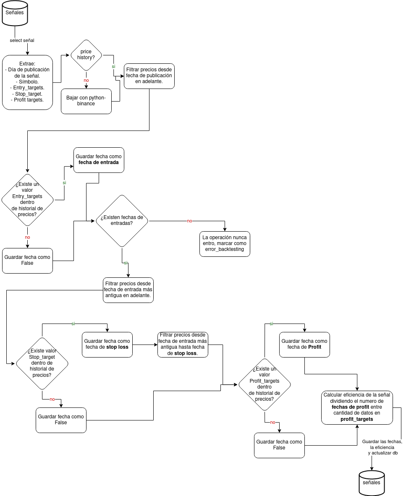


##### Diagrama 2: Proceso de generación de datos por backtesting.

El backtesting se ejecuta recorriendo el historial de precios de la moneda en la operación, por lo que el historial de precios de la moneda también es un conjunto de datos necesario para el Data Mining.

Historial de Precios de Criptomonedas

Explicación: El historial de precio es una serie de tiempo que contiene la variación del precio de una criptomoneda y la fecha de cuando fue capturada esa información. La fecha de captura puede variar según el intervalo entre los datos, Los intervalos pueden ser desde 5 min, 1 día, 1 mes o 1 año.

Datos:

##### Tabla 5: [Datos contenidos en el historial de precio de criptomonedas].

| Key | Formato | Descripción |
| --- | --- | --- |
| open | str | Valor de precio en el que abrió el intervalo. |
| high | str | Valor de precio más alto dentro del intervalo. |
| low | str | Valor de precio más bajo dentro del intervalo. |
| close | str | Valor de precio en el que cerró el intervalo. |
| volume | str | Indica el número total de operaciones dentro del intervalo del tiempo. |
| date\_myUTC | str | Indica la fecha y hora en la que se inicia el intervalo. |

Nota: El intervalo aplicado fue de 5 min.

Origen: API, Binance.

Método: El historial de precios de criptomonedas es obtenido a través de una API por medio de la librería python-binance que extrae la información directamente de las criptomonedas desde Binance.

El proceso primero determina si ya fueron solicitados y guardados los datos históricos del símbolo de criptomoneda determinado por la señal capturada de Telegram, si no existen los datos, el algoritmo los crea desde la fecha del primer registro hasta la fecha del último registro; por otro lado, si ya existe un registro de datos, el algoritmo revisa la fecha el último registro y actualiza los datos desde esa fecha.

Herramientas aplicadas en el proceso de ETL:

##### Tabla 6: [Librerías aplicadas en el proceso de obtención del historial de precios].

| Nombre | Uso | Objetos |
| --- | --- | --- |
| os | Lee la carpeta en donde se guardan los datos históricos del par de criptomonedas e indica si ya existe el archivo correspondiente. | Binance\_get\_data.py |
| python-binance | La librería contiene funciones que entregan información sobre los pares de criptomonedas.<br><br><br><br>Por lo que se usaron estas funciones para obtener el historial de precios en intervalos de 5 minutos y actualizar el historial cada vez que fuese necesario. | Binance\_get\_data.py |
| pandas | Se utilizan pandas para guardar y leer los historiales de precios en formatos .pickle ideales para almacenar grandes cantidades de datos. | Binance\_get\_data.py |

Este proceso de ETL no almacenó data en la base de datos, debido a que estos datos se acumulan y suelen pesar demasiado, además no son requeridos para el análisis de datos y entrenamiento del modelo principal.

Esquema del método:

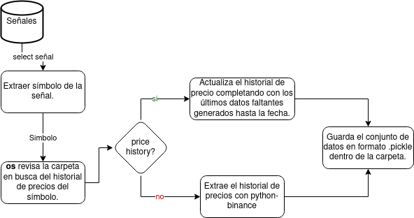

##### Diagrama 3: Proceso de descarga de historial de precios por API de Binance.

Datos de Recomendación por Análisis Técnico

Explicación: Como elemento validador de tendencia se aplicará una recomendación por análisis técnico, aportando información de sí la tendencia es long, short o neutral por cada operación e indicadores aplicados, este proceso es nombrado como ta\_recomendation.

Datos:

##### Tabla 7: [Datos generados en el proceso de TA recomendation].

| Key | Formato | Descripción |
| --- | --- | --- |
| ta\_recomendation | dict | Contiene un conjunto de recomendaciones de tendencias dada por un conjunto de análisis técnicos.<br><br><br><br>El diccionario contiene Keys y Values.<br><br><br><br>Las keys son los nombres de las técnicas de análisis técnico aplicadas y los values son las recomendaciones, estas pueden ser long, short y neutral. |
| error\_ta\_recomendation | datetime | Contiene la fecha y hora del momento cuando ocurrió un error al aplicar ta\_recomendation sobre la señal.<br><br><br><br>El objetivo es usar esa fecha y hora para conseguir el error ocurrido en un archivo .loge en donde está registrado cada proceso de la operación y posteriormente corregirlo, además permite limpiar el conjunto de datos de los datos nulos obtenidos por estos errores. |
```json
"ta\_recomendation": {

   "AO": "neutral",

   "RSI": "neutral",

   "ADX": "neutral",

   "CCI20": "long",

   "Stoch": "neutral"

 }

 "error\_ta\_recomendation": {

   "$numberDouble": "NaN"

 }
```

##### Figura 5.3: Estructura en formato .BSON de los datos del TA recomendation. (fuente: autor).

Origen: Algoritmo construido para aplicar el proceso.

Método: Aplicando análisis técnicos directamente sobre los datos históricos de las criptomonedas con Pandas\_ta se obtienen las recomendaciones de tendencias, actualmente solo se aplican los siguientes cinco indicadores de análisis técnicos:

- RSI
- AO
- ADX
- CCI20
- Stoch

Para este proceso se construyeron 2 objetos python el ta\_calculator.py para realizar el cálculo de los análisis técnicos y el ta\_recomendation.py para convertir esos cálculos en información referente a la tendencia.

Herramientas aplicadas en el proceso de ETL:

##### Tabla 9: [Librerías utilizadas para el proceso de TA recomendation].

| Nombre | Uso | Objetos |
| --- | --- | --- |
| pandas\_ta | Se realizaron los cálculos de los valores de los análisis técnicos, proceso que ya trae la librería implementada en sus funciones. | ta\_calculator.py |
| pandas | Lee los datos históricos guardados en el formato .pyckle.<br><br><br><br>Lee la base de datos de las señales y extrae la fecha de publicación junto al símbolo de la señal. | ta\_calculator.py |
| pymongo | Lee la base de datos de las señales para su manejo.<br><br><br><br>Incorpora y actualiza los datos calculados sobre la base de datos. | ta\_calculator.py<br><br>ta\_recomendation.py |
| python-binance | Uso de la librería para obtener los precios históricos de los símbolos de criptomonedas. | Binance\_get\_data.py |

Esquema del método:

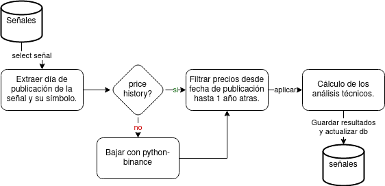

##### Diagrama 4: Proceso TA recomendation para la generación de datos.

Datos de Prophet Testing

Explicación: Como elemento validador de tendencia, el algoritmo prophet de facebook arroja una serie de datos interesantes a evaluar, como lo son el pronóstico de la tendencia futura del precio, y el pronóstico de las tendencias presentadas según el día, el mes y la hora.

Para este análisis de datos se utilizaron los datos del pronóstico de la tendencia junto a los datos de tendencia por día de operación.

Datos:

##### Tabla 10: [Datos generados en el proceso de Prophet testing].

| Key | Formato | Descripción |
| --- | --- | --- |
| forecast\_trend | str | Indica la tendencia de la predicción realizada por prophet. |
| day\_value | dict | Contiene los días y su valor relativo según la tendencia presentada por la predicción.<br><br><br><br>Las keys son los nombres de los días de la semana y los values son el valor relativo. |
| trend\_day | str | Presenta la tendencia pronosticada existente un día después de la publicación de la señal. |
| best\_params | dict | Presenta los hiper parámetros con mejores resultados utilizados para realizar el pronóstico. |
| score | dict | Contiene el valor y los métodos usados para determinar la eficiencia del pronóstico. |
| error\_prophettesting | datetime | Contiene la fecha y hora del momento cuando ocurrió un error al aplicar prophet testing sobre la señal.<br><br><br><br>El objetivo es usar esa fecha y hora para conseguir el error ocurrido en un archivo .loge en donde está registrado cada proceso de la operación y posteriormente corregirlo, además permite limpiar el conjunto de datos de los datos nulos obtenidos por estos errores. |

```json
 "forecast\_trend": "long",

 "day\_value": {

   "Sunday": -0.004869606334501983,

   "Thursday": -0.0010179111371535546,

   "Monday": 0.0006584240483294975,

   "Wednesday": 0.0006797049105716736,

   "Saturday": 0.0008815943198144789,

   "Tuesday": 0.001739673345543397,

   "Friday": 0.0019281208473967842

 },

 "trend\_day": "short",

 "best\_params": {

   "changepoint\_prior\_scale": 0.1,

   "seasonality\_prior\_scale": 0.005,

   "seasonality\_mode": "multiplicative"

 },

 "score": {

   "mae": 9.121461230470507,

   "rmse": 9.176220134467995,

   "mape": 0.02400296066312087

 },

 "error\_prophettesting": {

   "$numberDouble": "NaN"

 }
```

##### Figura 5.4: Estructura en formato .BSON de los datos del Prophet testing. (fuente: autor).

Origen: Algoritmo de Machine Learning

Método: Al algoritmo se le entregan datos históricos del precio de la criptomoneda, fecha de la publicación de la operación y cuanto tiempo en el futuro queremos el pronóstico donde basados en los datos arrojados en el apartado exploración de los datos, se puede determinar que 1 hora después de la publicación es el tiempo se pronosticó ideal para la mayoría de las operaciones;  para ser entrenado el algoritmo, se realiza un ciclo de cross validation, en donde prueba múltiples parámetros en varios intervalos de tiempo y calcula el score de eficiencia que aportan estos parámetros, por último determina los mejores parámetros con el mejor score y selecciona estos parámetros para entrenar el modelo, luego de construir el modelo realiza el pronóstico y extrae todos los datos relevantes.

Para este proceso se crearon dos objetos, ToolsProphet.py que contiene todas las herramientas de prophet encerradas en funciones para un mejor manejo y Prophettesting.py para efectuar todo el proceso de evaluar la señal y actualizar los datos.

Herramientas aplicadas en el proceso de ETL:

##### Tabla 11: [Librerías utilizadas para el proceso de Prophet testing].

| Nombre | Uso | Objeto |
| --- | --- | --- |
| Prophet | Se aplicó como algoritmo de machine learning para obtener el pronóstico sobre una serie de tiempo (compuesta por 2 meses de datos),  1 hora después de su última fecha (la fecha de publicación de la señal).<br><br><br><br>Se aplicaron las funciones de cross validation y performance metrics que contiene la librería. | ToolsProphet.py |
| Pandas | Lee los datos históricos guardados en el formato .pyckle y sesga los mismos datos entre dos fechas determinadas.<br><br><br><br>Lee la base de datos de las señales y facilita su manejo. | ToolsProphet.py<br><br>Prophettesting.py |
| Pymongo | Baja la base de datos de las señales para su manejo.<br><br><br><br>Incorpora y actualiza los datos calculados sobre la base de datos. | Prophettesting.py |
| Intertools | Con la herramienta se realizó el proceso de repartir todas las posibles combinaciones de parámetros. | ToolsProphet.py |
| Matplolib.pyplot | Entre las funciones se agregó una específicamente para graficar una porción de los datos de entrada junto a la predicción dada por el algoritmo, con el objetivo de dar una visualización del pronóstico. | ToolsProphet.py |

Esquema del método:

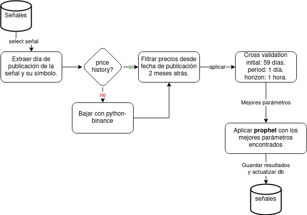

##### Diagrama 5: Proceso Prophet testing para la generación de datos.

### Exploración de los Datos

Para el proceso de exploración de los datos, las tareas se centrarán en responder las siguientes preguntas:

- ¿Cantidad de datos extraídos?
- Rangos de tiempo evaluados.
- Cantidad de señales captadas por canal.
- ¿Cuál es el símbolo con mayor cantidad de aciertos por canal?
- ¿Cuál es el canal con mejor relación aciertos/fallos?

Cantidad de Datos y Campos Principales Obtenidos de los Datos de la Señales

##### Tabla 12 [Principales características del conjunto de datos].

| Cantidad de datos: | 1554 señales |
| --- | --- |
| Número de campos: | 35 campos |
| Cantidad de datos con elementos nulos: | 148 señales |
| Cantidad de datos sin ningún elemento nulo: | 1396 señales |

##### 

Rangos de Tiempo Evaluados

##### Tabla 13:[ Rangos de tiempo de captura de mensajes por canal].

| Canales | Tiempo inicial | Tiempo final |
| --- | --- | --- |
| Todos | 2021-02-17 | 2022-06-17(658 días) |
| Crypto Futures Spot Signals😘 | 2020-08-28 | 2022-06-14 (655 días) |
| ğ‘ªğ’ğ’Šğ’|ğ‘ªğ’ğ’‚ğ’„ğ’‰|ğ‘ºğ’Šğ’ˆğ’ğ’‚ğ’ğ’” | 2021-02-17 | 2022-06-16 (484 días) |
| Bitcoin Bullets VIP Free | 2021-08-30 | 2022-06-17(290 días) |
| Federal Russian Insiders VIP Free | 2021-07-26 | 2022-06-17 (326 días) |

Cantidad de Señales por Canal

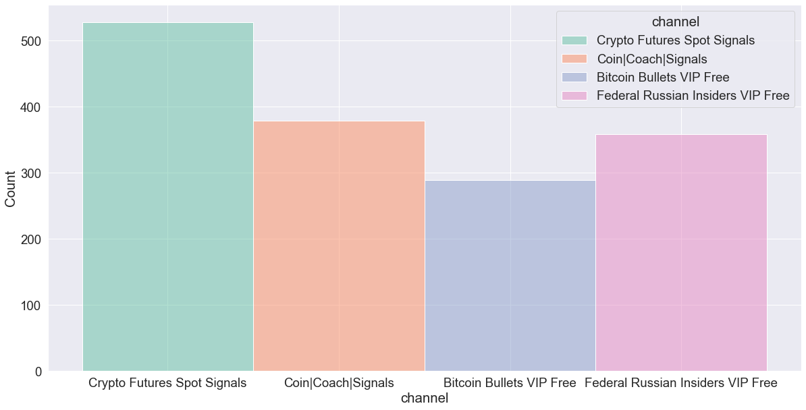

##### Gráfica 1: Cantidad de señales capturadas por canal. (fuente: autor).

En la gráfica 1 se puede ver que el canal con más operaciones realizadas es Crypto Futures Spot Signals. Al revisar la gráfica 2, que ilustra la eficiencia  de las operaciones por canal, tenemos que también es el canal con mayor cantidad de resultados sin ganancia.

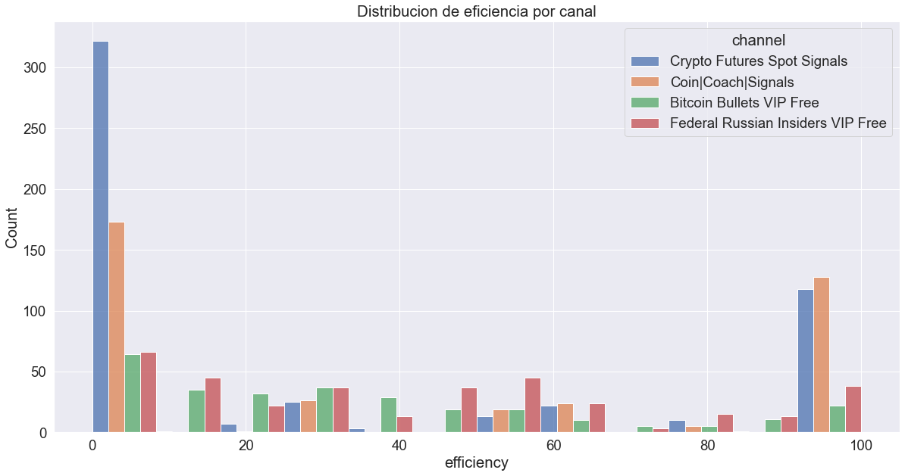

##### Gráfica 2: Eficiencia de las señales separadas por canal. (fuente: autor).

                Para simplificar el resultado de las operaciones, se redujo la eficiencia en operaciones con ganancias (eficiencias mayor a 0) y operaciones sin ganancia (eficiencia igual a 0) generando un nuevo campo llamado is\_profit que entrega los valores profit y no\_profit respectivamente, aplicando este campo tenemos la siguiente gráfica.

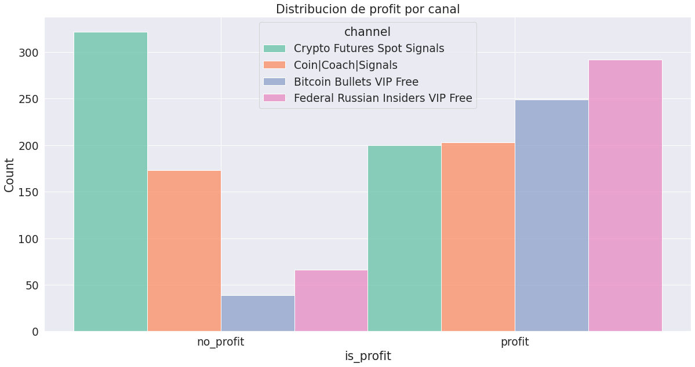

##### Gráfica 3: Resultados de las señales separadas por canal. (fuente: autor).

Los canales con mayor cantidad de resultados favorables son Bitcoin Bullets VIP Free y Federal Russian Insiders VIP Free.

Cantidad de Señales por Símbolo

        Los datos manejan un total de 242 pares de símbolos, al ser representados por canal obtenemos las siguientes gráficas.

- Crypto Futures Spot Signals: El canal con mayor deficiencia en resultados presenta 208 pares de operaciones.

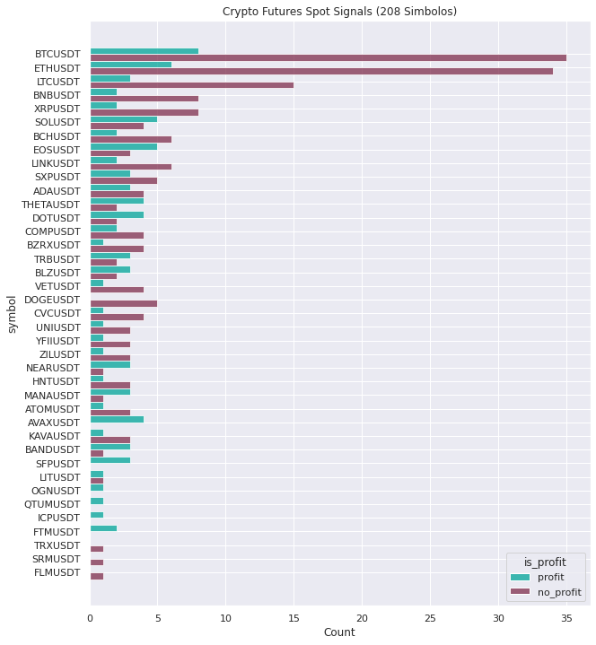

##### Gráfica 4: Resultados por cada símbolo en Crypto Futures Spot Signals. (fuente: autor).

- Coin|Coach|Signals: El canal con resultados medianamente favorables presenta 112 pares en sus operaciones.

##### Gráfica 5: Resultados por cada símbolo en Coin|Coach|Signals. (fuente: autor).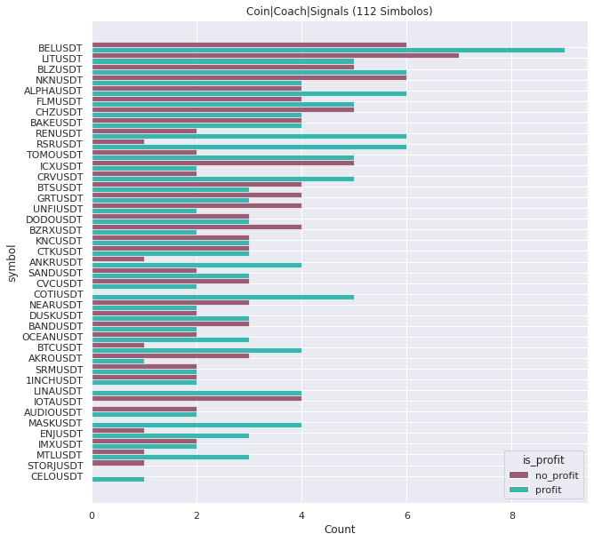

- Bitcoin Bullets VIP Free: Canal con resultados favorables presenta 65 pares en sus operaciones.

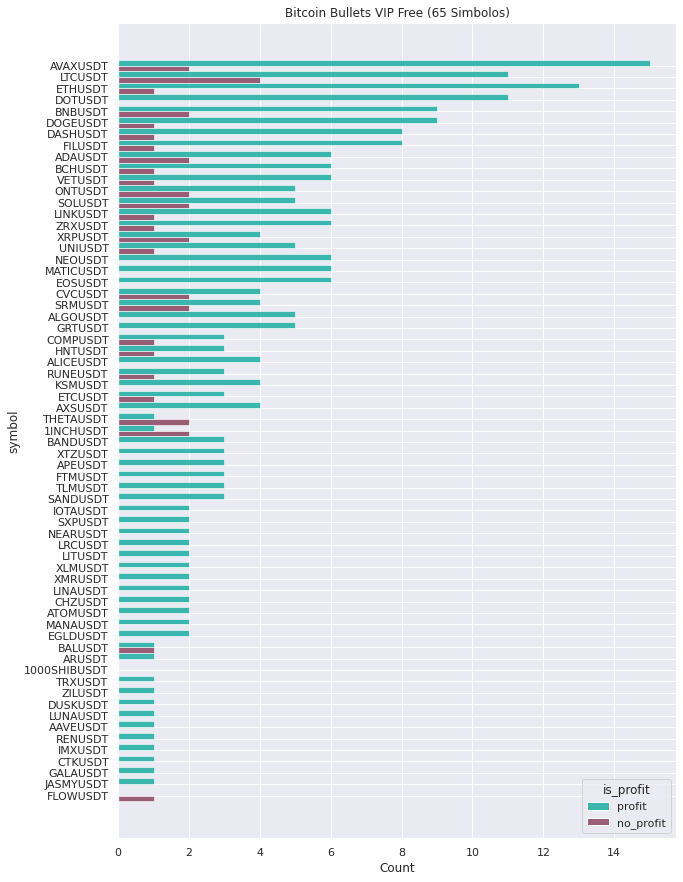

##### Gráfica 7: Resultados por cada símbolo en Bitcoin Bullets VIP Free. (fuente: autor).
* * *

- Federal Russian Insiders VIP Free: Canal con favorables resultados presenta 68 pares en sus operaciones.

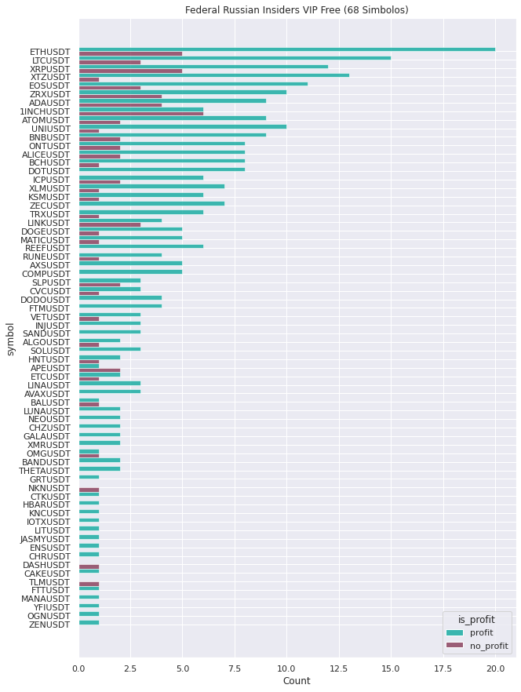

##### Gráfica 8: Resultados por cada símbolo en Federal Russian Insiders VIP Free. (fuente: autor).

Se puede intuir una posible correlación entre la cantidad de pares presentados por grupo de operaciones del canal y la eficiencia del canal al detallar que el canal con peores resultados maneja un total de 208 símbolos de pares, el canal con resultados medios maneja 112 símbolos y los canales con mejores resultados manejan menos de 70 símbolos.

### Verificación

Para el proceso de verificación de la calidad de los datos, las tareas se centrarán en:

- Buscar datos nulos o vacíos.

Para la siguiente fase del proceso se quitaron los 11 campos is\_free, is\_future, message\_id, percent\_amount, quantity, quantity\_take\_profit, symbol\_message, timeStamp\_Tg, \_id, quantity\_trailing\_configuration, y symbol\_message al no contener información relevante para el análisis de datos y contener datos nulos.

Además se retiraron 3 campos resultantes del prophet testing day\_value, best\_params y score que solo son necesarios para llevar un control del modelo Prophet aplicado en el proyecto.

- Verificar el formato de los datos.

        En los datos iniciales se presentaron los formatos bool(2 campos), datetime(4 campos), int(1 campo), str(6 campos), list(3 campos) y dict(8 campos).

- Revisar la cantidad de datos disponibles.

Al reducir los campos la cantidad de datos sin elementos nulos aumentó a 1421 señales.

## Fase 3; Preparación de los datos.

### Seleccionar los Datos

Extraer los Datos de los 8 Campos en Formato Dict

        Los 8 campos en formato diccionario le fueron extraídos sus keys junto a su respectivos valores para generar nuevos campos y aprovechar sus datos. Los datos tipo diccionario son retirados del data frame.

Los nuevos campos son:

##### Tabla 14: [Nuevos campos extraídos de campos con formato dict].

| key | Formato | Descripción |
| --- | --- | --- |
| type\_leverage | str | Indica el tipo de leverage en la operación. |
| is\_cross\_leverage | bool | Indica si la operación es de tipo cross. |
| percent\_leverage | int | Indica el porcentaje de leverage. |
| percent\_trailing\_configuration | int | Indica la configuración de entrada. |
| AO | str | Tendencias indicadas por el respectivo análisis técnico, los valores pueden ser long, short y neutral |
| RSI | str |
| ADX | str |
| CCI20 | str |
| Stoch | str |
| first\_dates\_entry | datetime | Indica la fecha del primer cumplimiento de entrada a la operación. |
| first\_dates\_stoploss | datetime | Indica la fecha del cumplimiento de stop loss sobre la operación. |
| first\_dates\_profit | datetime | Indica la fecha del primer cumplimiento de ganancia con operación. |
| changepoint\_prior\_scale\_bp | float | Hiper parámetros calculados en cross validation, utilizados para aplicar prophet sobre la señal relacionada. |
| seasonality\_prior\_scale\_bp | float |
| seasonality\_mode\_bp | float |
| mae\_bp | float | Métricas obtenidas  calculando los hiper parámetros en cross validation. |
| rmse\_bp | float |
| mape\_bp | float |
| primary\_currencies | str | Indica el símbolo de la moneda principal de la operación. |
| segundary\_currencies | str | Indica el símbolo de la moneda secundaria sobre la cual se relaciona el precio de la moneda principal. |

Obtener Información Valiosa de los 3 Campos en Formato de Listas

De las listas conformadas por los camposentry\_targets y take\_profit\_targets se obtienen la cantidad de datos que contienen para generar dos nuevos campos profit\_count y entry\_count. 

Con los datos entry\_count y profit\_count se busca determinar una correlación existente con el resultado de la operación. La cantidad de entradas y objetivos de ganancia pueden ser el resultado de la estrategia aplicada en el trading. Esto arroja las siguientes gráficas:

- Correlación entre la cantidad de objetivos de entrada y resultado final.

##### 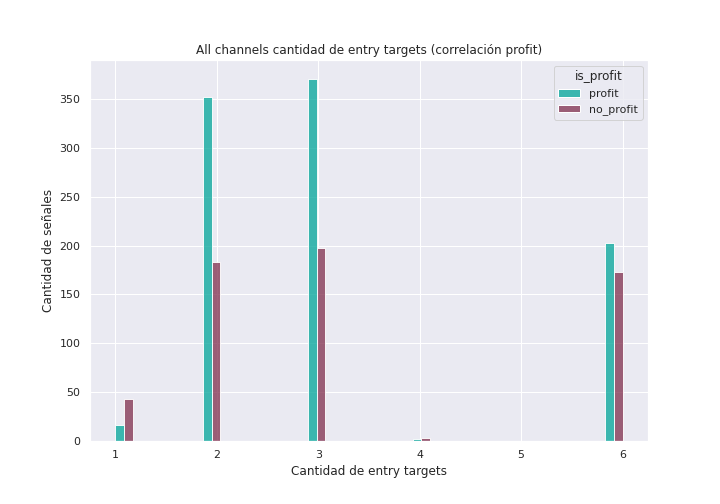Gráfica 9: Correlación entre la cantidad de objetivos de entrada y resultado final para todos los canales. (fuente: autor).

##### 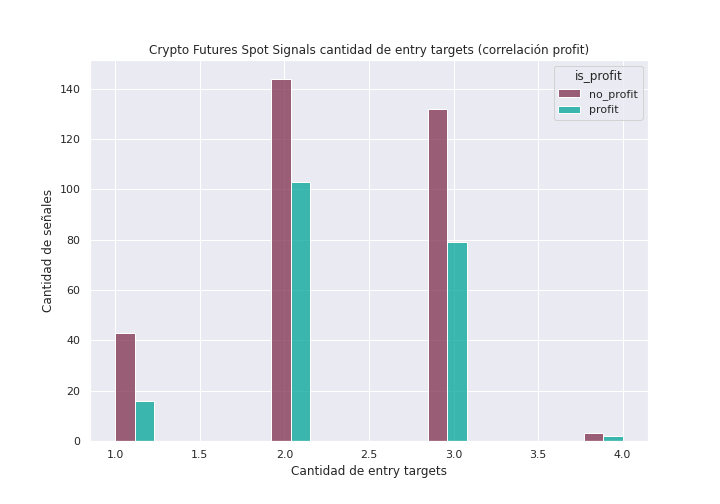

##### Gráfica 10: Correlación entre la cantidad de objetivos de entrada y resultado final Gráfica para Crypto Futures Spot Signals. (fuente: autor).

##### 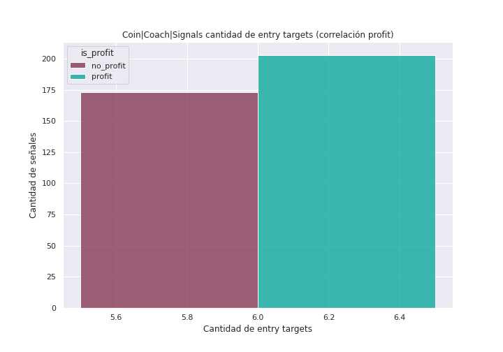Gráfica 11: Correlación entre la cantidad de objetivos de entrada y resultado final para Coin|Coach|Signals (fuente: autor).

##### 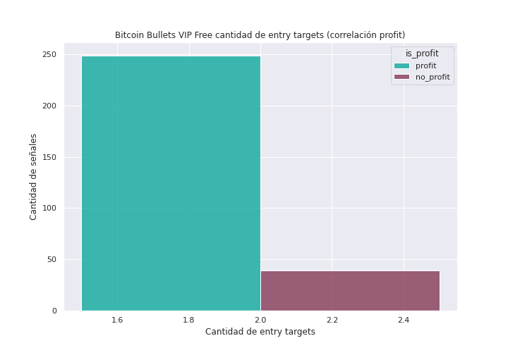

##### Gráfica 12: Correlación entre la cantidad de objetivos de entrada y resultado final para Bitcoin Bullets VIP Free (fuente: autor).

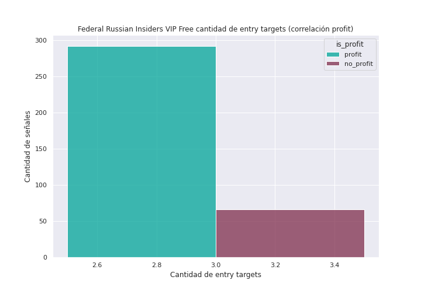

##### Gráfica 13: Correlación entre la cantidad de objetivos de entrada y resultado final para Federal Russian Insiders VIP Free (fuente: autor).

- Correlación entre cantidad de objetivos de profit y resultado final.

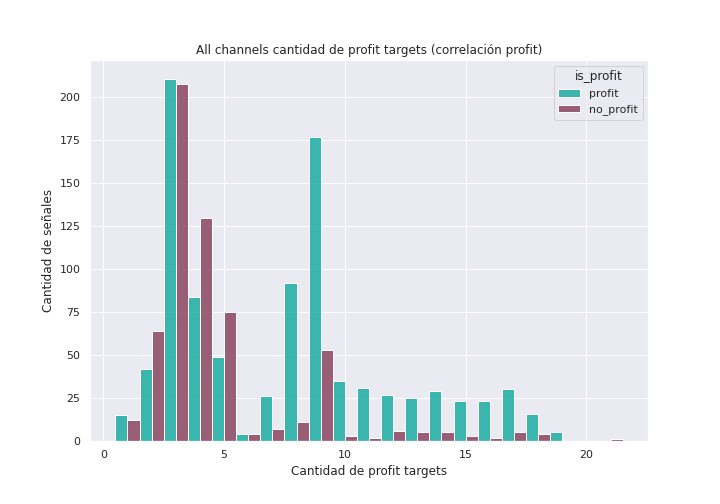

##### Gráfica 14: Correlación entre la cantidad de objetivos de profit y resultado final para todos los canales (fuente: autor).

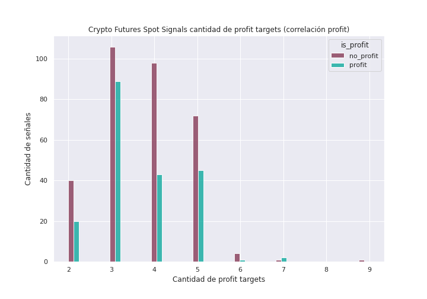

##### Gráfica 15: Correlación entre la cantidad de objetivos de profit y resultado final para Crypto Futures Spot Signals (fuente: autor).

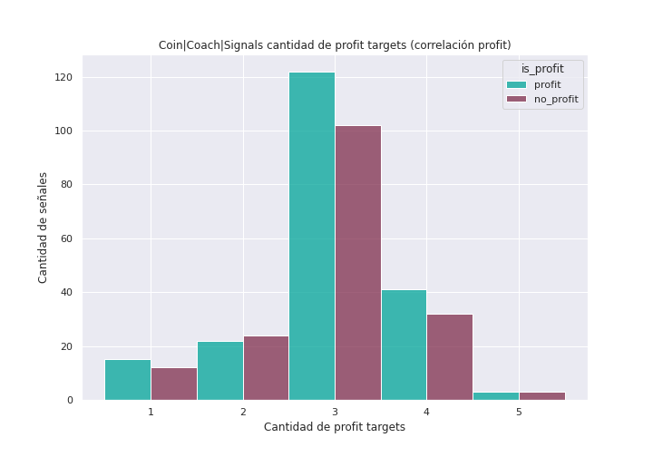

##### Gráfica 16: Correlación entre la cantidad de objetivos de profit y resultado final para ğ‘ªğ’ğ’Šğ’|ğ‘ªğ’ğ’‚ğ’„ğ’‰|ğ‘ºğ’Šğ’ˆğ’ğ’‚ğ’ğ’” (fuente: autor).

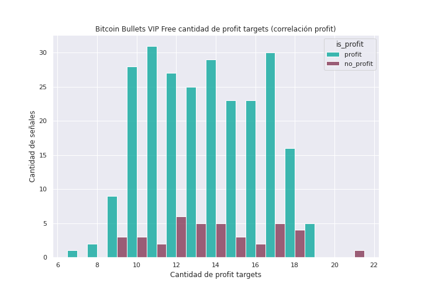

##### Gráfica 16: Correlación entre la cantidad de objetivos de profit y resultado final para Bitcoin Bullets VIP Free (fuente: autor).

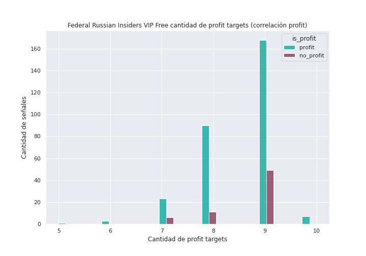

##### Gráfica 17: Correlación entre la cantidad de objetivos de profit y resultado final para Federal Russian Insiders VIP Free (fuente: autor).

Podemos observar que en el conjunto de gráficos, de cantidad de objetivos de entrada, los gráficos básicamente muestran que cada canal presenta un número de objetivos específicos y que no existe una correlación aparente.

Por otro lado, en los gráficos relacionados con la cantidad de objetivos de profit, se observa una posible correlación en el primer gráfico, pero al separar los datos por canal, vemos que los resultados son parecidos al comportamiento de las señales por canal.

### Limpiar los Datos

Para limpiar los datos simplemente se extrajeron las señales que presentaban fechas en los errores de cada proceso, error\_backtesting, error\_ta\_recomendation y error\_prophettesting.

### Integrar los Datos

Esta tarea  busca juntar datos de orígenes distintos, y crear nuevos campos que contengan nueva información.

Tiempos Transcurridos Entre Objetivos de Operación

En vista de la necesidad de aplicar el modelo Prophet para el pronóstico de las operaciones, es necesario conocer el comportamiento de las operaciones a través del tiempo para evaluar cuánto tiempo en el futuro es necesario pronosticar con el algoritmo.

Este proceso se logra obteniendo las primeras fechas de los datos de entrada, las primeras fechas de ganancia, fecha de salida por stop loss y fecha de publicación de la operación, todos obtenidos en el proceso de backtesting.

Luego de obtener las primeras fechas se realiza sobre estos el cálculo de los tiempos transcurridos entre las fechas en el siguiente orden:

- Tiempo transcurrido desde fecha de publicación hasta fecha de la primera entrada.
- Tiempo transcurrido desde fecha de publicación hasta fecha de la primera ganancia.
- Tiempo transcurrido desde fecha de publicación hasta fecha de salida por stop loss.
- Tiempo transcurrido desde fecha de la primera entrada hasta fecha de la primera ganancia.

El resultado de estos datos es muy variado como para utilizar la Media o la Mediana de los datos y conseguir un posible comportamiento estándar, por lo que los datos fueron tratados como datos categóricos, pasando a localizar los datos más frecuentes por canal, arrojando las siguientes gráficas:

Las gráficas en forma de pie contienen en su perímetro el valor en horas del conjunto representado dentro de la porción del pie, mientras que, en el interior de la porción contiene el número de operaciones.

- Tiempos entre publicación y entrada de la operación.

- Operaciones con ganancias.

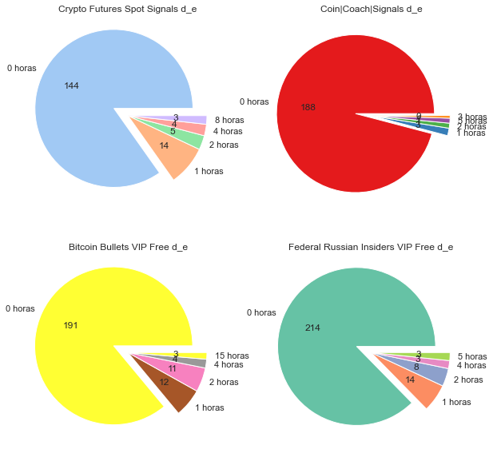


##### Gráfica 18: Tiempos entre publicación y entrada de la operación para Operaciones con ganancias. (fuente: autor).

- Operaciones sin ganancias.

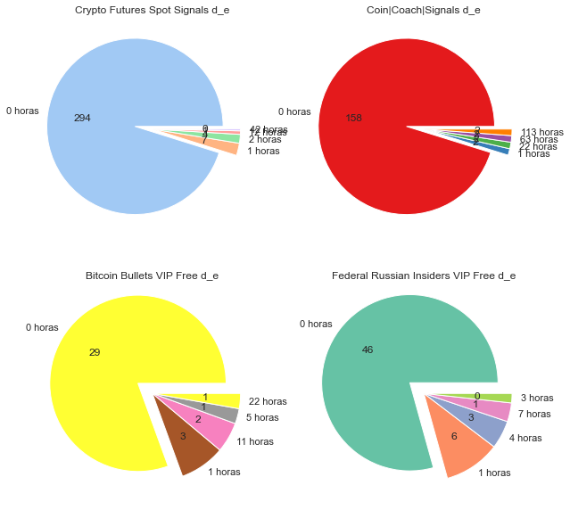


##### Gráfica 19: Tiempos entre publicación y entrada de la operación para Operaciones sin ganancias. (fuente: autor).

- Tiempos entre publicación y primera ganancia de la operación.

- Operaciones con ganancias.

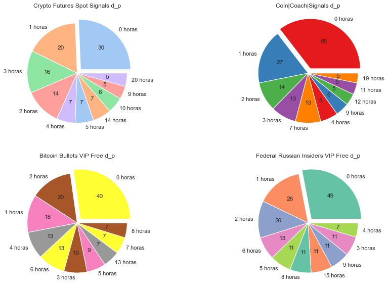


##### Gráfica 20: Tiempos entre publicación y primera ganancia de la operación para Operaciones con ganancias. (fuente: autor).

- Operaciones sin ganancias.

No hay gráficos porque los datos requieren que exista una ganancia.

- Tiempos entre entrada de la operación y primera ganancia de la operación.

- Operaciones con ganancias.

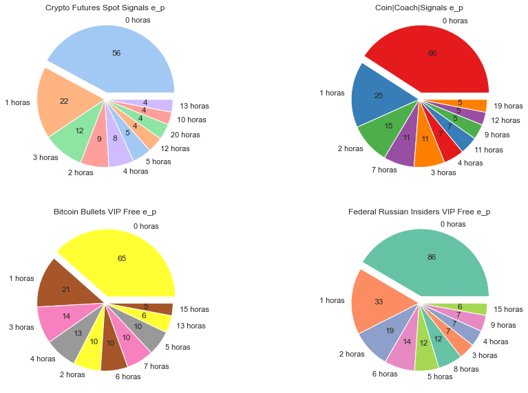


##### Gráfica 21: Tiempos entre entrada de la operación y primera ganancia de la operación para Operaciones con ganancias. (fuente: autor).

- Operaciones sin ganancias.

        No hay gráficos porque los datos requieren que exista una ganancia.

- Tiempos entre publicación y salida por stop loss de la operación.

- Operaciones con ganancias.

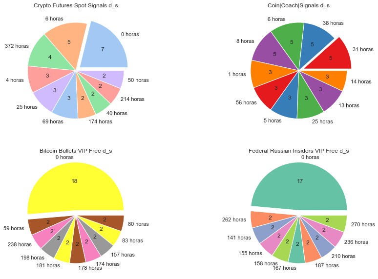


##### Gráfica 22: Tiempos entre publicación y salida por stop loss de la operación para Operaciones con ganancias. (fuente: autor).

- Operaciones sin ganancias.

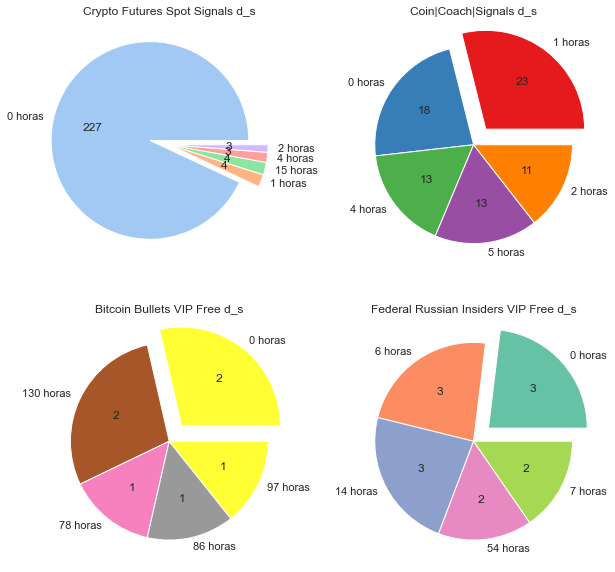


##### Gráfica 23: Tiempos entre publicación y salida por stop loss de la operación para Operaciones sin ganancias. (fuente: autor).

Con las gráficas de los tiempos podemos determinar que la mayoría de ellos se encuentran por debajo de 1 hora y este dato es el necesario para indicar al modelo predictivo Prophet cuanto tiempo en el futuro es ideal realizar el pronóstico y también nos indica que la mayoría de los canales realizan operaciones intradiarias.

Comportamiento de los Datos en Función a las Recomendaciones por Análisis Técnico

Para revisar este comportamiento se crearon los datos de confirmación de tendencia por análisis técnicos, los datos se generaron comparando la tendencia recomendada por los indicadores con las tendencias indicadas por el dato is\_long.

El resultado fueron los siguientes campos de datos , AO\_confirmation, RSI\_confirmation, ADX\_confirmation, CCI20\_confirmation, Stoch\_confirmation que contienen los números  1, 0 y -1 representando la siguiente información:

- 1 confirma la tendencia indicada en el dato is\_long.
- 0 no confirma ninguna tendencia indicada en el dato is\_long.
- -1 confirma la tendencia opuesta a la indicada en el dato is\_long.

Al buscar una posible correlación entre las recomendaciones y el resultado de la operación obtenemos la siguiente tabla: 

##### Tabla 15 [Cantidad confirmaciones de tendencia por indicador de TA recomentation].

| is\_profit |  | AO | RSI | ADX | CCI20 | Stoch |
| --- | --- | --- | --- | --- | --- | --- |
| no\_profit | -1 | 33 | 28 | 11 | 37 | 13 |
| no\_profit | 0 | 508 | 527 | 547 | 495 | 539 |
| no\_profit | 1 | 27 | 13 | 10 | 36 | 16 |
| profit | -1 | 37 | 33 | 16 | 45 | 19 |
| profit | 0 | 791 | 806 | 830 | 735 | 814 |
| profit | 1 | 44 | 33 | 26 | 92 | 39 |

En los datos que no registran ganancias no existe una correlación aparente con las recomendaciones, pero en los datos que sí registran profit existe un valor alto en las confirmaciones con profit en el análisis técnico CCI 20.

Búsqueda de Posible Correlación Entre Profit y Porcentaje de Stop loss Aplicado.

Con el dato de entry\_targets y stop\_targets se calcula el porcentaje que representa el valor de stop\_target relativo al primer valor de los entry\_targets y es guardado en los datos como av\_stoploss, este valor representa al porcentaje de stop loss aplicado dentro de la operación. Este valor es significativo porque determina cuánto es el riesgo que está dispuesto a manejar el trader de la operación. Para determinar la posible correlación presentamos las siguientes gráficas separadas por canal:

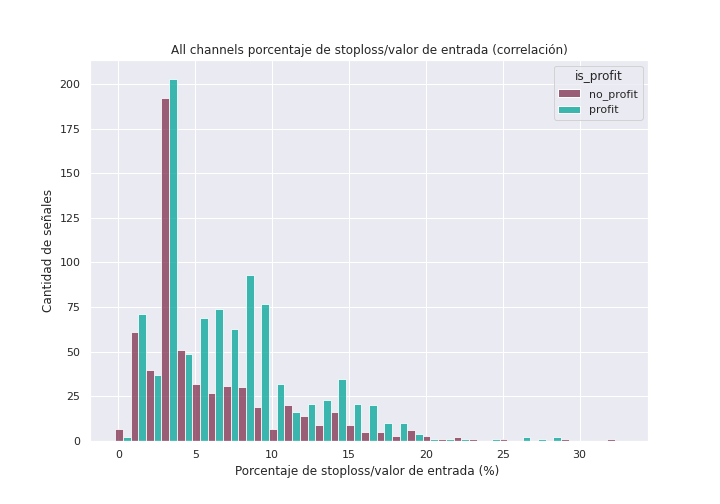

##### Gráfica 24: Histograma entre profit y porcentaje de stop loss aplicado para todos los canales (fuente: autor).


##### Gráfica 25: Histograma entre profit y porcentaje de stop loss aplicado para Crypto Futures Spot Signals (fuente: autor).

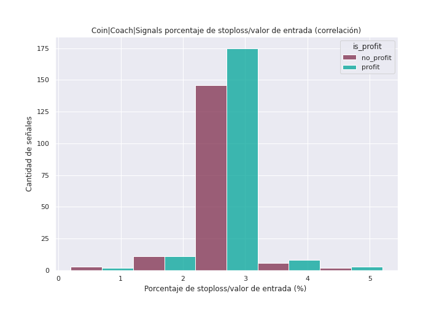

##### Gráfica 26: Histograma entre profit y porcentaje de stop loss aplicado para ğ‘ªğ’ğ’Šğ’|ğ‘ªğ’ğ’‚ğ’„ğ’‰|ğ‘ºğ’Šğ’ˆğ’ğ’‚ğ’ğ’” (fuente: autor).


##### Gráfica 27: Histograma entre profit y porcentaje de stop loss aplicado para Bitcoin Bullets VIP Free (fuente: autor).

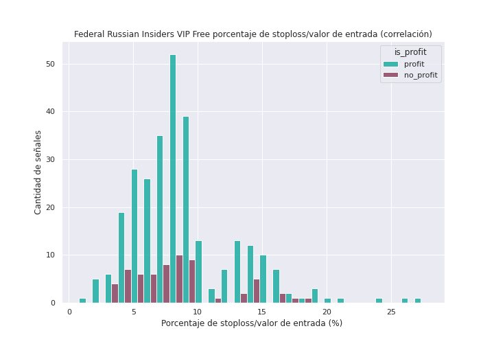

##### Gráfica 28: Histograma entre profit y porcentaje de stop loss aplicado para Federal Russian Insiders VIP Free (fuente: autor).

Búsqueda de Posible Correlación Entre Profit y Porcentaje de Profit Relacionado con la Primera Entrada Aplicada.

Con el dato de entry\_targets y take\_profit\_targets se calcula el porcentaje que representa el primer valor de los take\_profit\_targets relativo al primer valor de los entry\_targets y es guardado en los datos como av\_profit, este valor representa al porcentaje de profit aplicado dentro de la operación. Este valor es significativo porque determina cuánto es el porcentaje de ganancia que está dispuesto a manejar el trader de la operación.

Para determinar la posible correlación presentamos las siguientes gráficas separadas por canal:

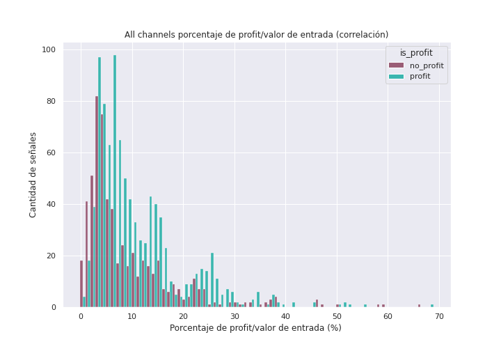

##### Gráfica 25: Histograma entre profit y porcentaje de profit relacionado con la primera entrada aplicada para todos los canales (fuente: autor).

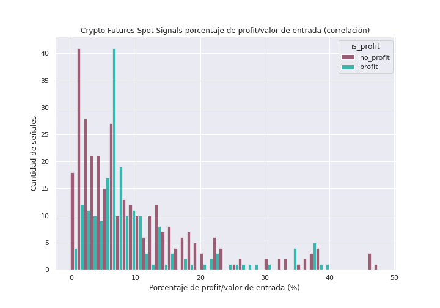

##### Gráfica 26: Histograma entre profit y porcentaje de profit relacionado con la primera entrada aplicada para Crypto Futures Spot Signals (fuente: autor).

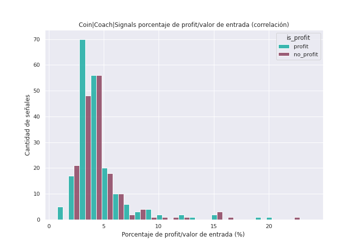

##### Gráfica 27: Histograma entre profit y porcentaje de profit relacionado con la primera entrada aplicada para ğ‘ªğ’ğ’Šğ’|ğ‘ªğ’ğ’‚ğ’„ğ’‰|ğ‘ºğ’Šğ’ˆğ’ğ’‚ğ’ğ’” (fuente: autor).

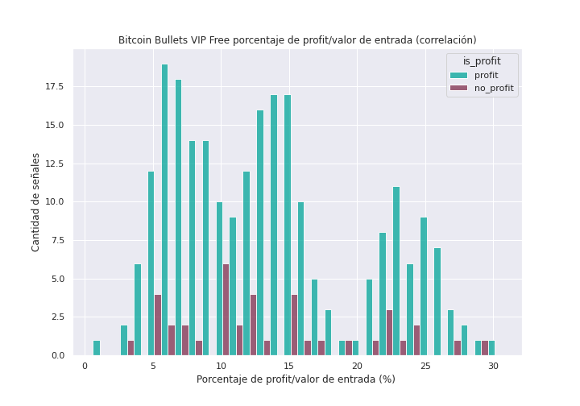

##### Gráfica 28: Histograma entre profit y porcentaje de profit relacionado con la primera entrada aplicada para Bitcoin Bullets VIP Free (fuente: autor).

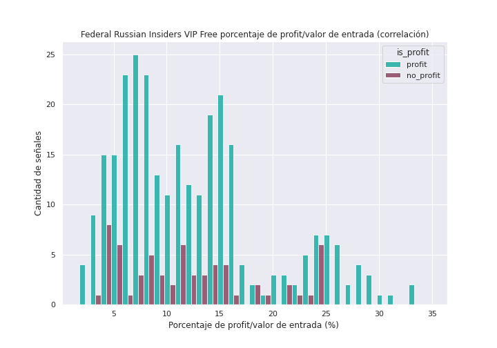

##### Gráfica 29: Histograma entre profit y porcentaje de profit relacionado con la primera entrada aplicada para Federal Russian Insiders VIP Free (fuente: autor).

El porcentaje de profit puede estar relacionado con el tipo de estrategia aplicado por el canal, por lo que la correlación mostrada 

Confirmadores de Tendencias con los Resultados de Prophet Testing

        Para tener el valor de los confirmadores de tendencias se crearon dos nuevos campos forecast\_trend\_confirm y trend\_day\_confirm en donde se compararon los campos forecast\_trend y trend\_day con el campo is\_long siguiendo la siguiente regla:

- Si el confirmador indicaba una tendencia igual a la tendencia de la operación se colocaba un valor True de lo contrario un valor False.

Al tener estos campos se retiraron los campos forecast\_trend y trend\_day.

### Formateo de los datos

En el formateo de los datos el objetivo es transformar los datos a un tipo de dato que permita el entrenamiento del modelo seleccionado sin modificar su significado.

Al ser un problema de clasificación supervisado se escogió como mejor modelo de machine learning al XGBoots para su predicción.

El modelo no es ideal para datos categóricos, a estos datos se les aplicó la técnica one-hot.

En la Figura 5.5 podemos ver la columna channel antes de aplicar el one-hot y en la Figura 5.6 el resultado de ejecutar el proceso de one-hot.

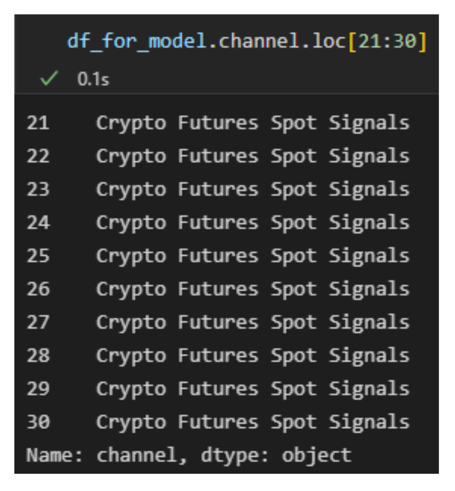

##### Figura 5.5: Campo de nombre de canales en dataframe señales 21-30. (fuente: autor).

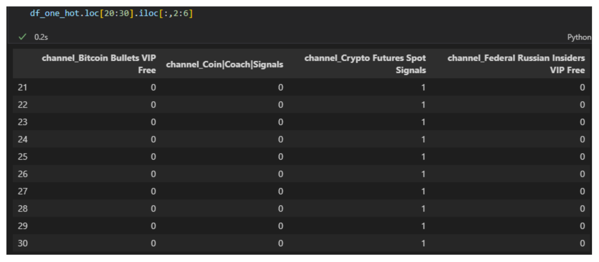

##### Figura 5.6: Campo de nombre de canales formateado con one-hot señales 21-30. (fuente: autor).

## Fase 4; El modelado.

### Seleccionar técnica de modelado

        El modelo de clasificación seleccionado es el XGBoots al ser un modelo que entrega resultados muy rápido, no es complicado de aplicar, es una mejora del modelo random forest y es muy versátil.

### Generar plan de prueba

El conjunto de datos pasados al modelo son:

- Los campos independientes (X):

Son todos los campos resultantes de aplicar el método codificador one-hot a los siguientes campos con datos categóricos:

- is\_entry\_market
- is\_long
- channel
- primary\_currencies
- segundary\_currencies
- type\_leverage
- is\_cross\_leverage
- percent\_trailing\_configuration
- AO\_confirm\_trend
- RSI\_confirm\_trend
- ADX\_confirm\_trend
- CCI20\_confirm\_trend
- Stoch\_confirm\_trend
- forecast\_trend\_confirm
- trend\_day\_confirm

        Estos datos se juntaron con los campos con datos numéricos:

- profit\_count
- av\_profit
- av\_stoploss
- percent\_leverage

Generando un conjunto de datos con un total de 214 campos y 1421 filas representados en un data frame.

- Campos dependiente (Y):

        Es uno de los campos resultantes de aplicar el método codificador One-hot al campo:

- is\_profi

El conjunto de datos fue dividido en dos partes datos para entrenar (data training) y datos para testear  (data tests), para tener una división más exacta se calculó la relación existente entre los resultados favorables y los no favorables en el campo independiente con el objetivo de que los datos para entrenar y los datos para testear cumplan la misma relación. El valor relativo es de 0.63, indicando que el 63% de los datos dan resultados favorables.

Los resultados serán medidos con roc-auc y como ayuda visual se aplicará una matriz de confusión.

### Construir el modelo

1. Seleccionar un conjunto de hiperparametros.

El conjunto de hiperparametros aplicados para la prueba fueron 2:

- Ronda 1:

```json
param\_grid1={

"max\_depth":[4],

"learning\_rate":[0.1,0.5,1],

"gamma":[0.25],

"reg\_lambda":[10,20,100], 

"scale\_pos\_weight":[3]

}
```

- Ronda 2:

```json
param\_grid2={

"max\_depth":[3,4,5],

            "learning\_rate":[0.1,0.01,0.5],

            "gamma":[0,0.25,1],

            "reg\_lambda":[0,1.0,10.0],

            "scale\_pos\_weight":[1,3,5]

}
```

1. Pasar los hiperparametros por un proceso de cross validation y obtener los mejores parámetros para el conjunto de datos.

El método de cross validation aplicado en este caso es realizado con la herramienta GridSearchCV de sklearn. Permite realizar procesos de cross validation en paralelo, medir y comparar los resultados, implementar varios modelos y obtener un informe de cada iteración. Los resultados de este proceso arrojaron que los mejores parámetros son los de la Ronda 2, con los siguientes datos: {'gamma': 0, 'learning\_rate': 0.1, 'max\_depth': 3, 'reg\_lambda': 10.0, 'scale\_pos\_weight': 3}, ROC AUC: 0.76.

Estos son usados en el entrenamiento del modelo junto con los datos de entrenamiento.

### Evaluar el modelo

Luego de entrenar el modelo con los datos de entrenamiento y predecir los resultados de los datos de testeo, llega el momento de evaluar estos resultados y compararlos con los resultados reales de los datos de testeo.

La matriz de confusión arroja la siguiente gráfica que describe lo siguiente:

- De los 107 resultados con ganancia (profit) predijo acertadamente 64 y los otros 46 los predijo con fallo.
- De los 249 resultados sin ganancia (no\_profit) predijo acertadamente 175 y los otros 71 los predijo con fallo.

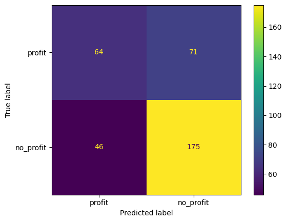

##### Gráfica 30: Matriz de confusión para los resultados modelo (fuente: autor).

        La métrica roc auc indica una eficiencia del 63%.

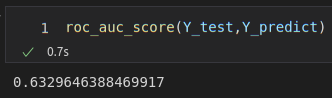

##### Figura 5.7: Resultados de la métrica ROC AUC para los resultados del modelo. (fuente: autor).

        Cálculo de la capacidad de predicción sobre operaciones sin ganancia y operaciones con ganancia.

        Los elementos que mayor importancia tomaron sobre el árbol de de decisiones fueron los siguientes:

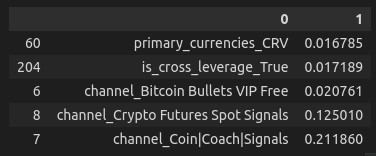

##### Figura 5.8: Campos y su importancia dentro del árbol de decisión. (fuente: autor).

## Fase 5; Fase de evaluación.

### Evaluar los Resultados

        Los resultados no cumplieron los objetivos de la minería de datos, los cuales es conseguir una eficiencia de entre el 80 y 70%, alcanzando una eficiencia del 63% para los datos testeados.

        Considerando que en el trading la mejor estrategia es aquella que controla las pérdidas y no las ganancias, pudiendo aplicarse un método de trading dinámico en donde el stoploss toma el valor de la primera ganancia para asegurar la primera ganancia. Se podría indicar aplicar el modelo para evaluarlo en situaciones reales con trading dinámico, pero, teniendo presente que por cuestiones de tiempo y recursos el modelo fue construido para obtener un producto mínimo viable con muchas características en donde poder ser mejorado, la indicación más exacta sería repasar el proceso.

### Revisión del proceso

Todo el proceso de data mining presentan las siguientes características:

Tabla 15 [Revisión por todo el proceso de metodología Crisp DM]

| Proceso | Calidad | Recomendación/nota |
| --- | --- | --- |
| Fase 1 | Buena | Ninguna. |
| Fase 2 |  |  |
| Recolectar los datos iniciales. | Buena | Se explica con detalle como es el proceso de captura de los datos. |
| Descripción de los datos. | Buena | Se explora cada dato y cual es su función y que representa. |
| Exploración de los datos. | Mejorable | Aunque se exploran dos factores importantes, de haber más es posible sacarle más provecho a esta tarea. |
| Verificar la calidad de los datos. | Buena | Se retiran muchos datos que no son necesarios para el análisis de datos ni el entrenamiento del modelo. |
| Fase 3 |  |  |
| Seleccionar los datos. | Buena | Se generan nuevos campos contenidos en formatos de datos poco aprovechables. |
| Limpiar los datos. | Buena | Con simplemente tener un campo que remarcaba los errores del proceso fue suficiente para limpiar los datos. |
| Estructurar los datos. | Buena | Ninguna. |
| Integrar los datos. | Buena | Se realizaron todas las posibles integraciones entre campos. |
| Formateo de los datos. | Buena | Ninguna |
| Fase 4 |  |  |
| Seleccionar técnica de modelado. | Buena | El modelo es el adecuado para el problema. |
| Generar el plan de prueba. | Buena | La cantidad de datos es aceptable y la división de los mismos es equivalente. |
| Construir modelo. | Mejorable | Es posible obtener unos mejores resultados en el proceso de cross validation. |
| Evaluar modelo. | Buena | La métrica de roc-auc entrega mucha información sobre el modelo. |
| Fase 5 |  |  |
| Evaluar los resultados. | Buena | Ninguna |
| Revisión del proceso. | Buena | Ninguna |
| Determinar los próximos pasos. | Buena | Son pasos necesarios y lógicos. |
| Fase 6 |  |  |
| Plan de implantación. | Buena | Ninguna |
| Plan de monitoreo y mantención. | Buena | Ninguna |
| Informe final y Revisión del proyecto. | No aplicado | Estas tareas vienen siendo dar las conclusiones del proyecto. |

##### 

### Determinar los próximos pasos

- Buscar mejorar los resultados obtenidos por los modelos Prophet y XGBoots.
- Aplicar un backtesting con trading dinámico.
- Para una primera implementación con el copy trading entrar en producción pero con trading dinámico y solo usando los canales con mejores resultados.
- Aplicar más indicadores de análisis técnico.

## Fase 6; Fase de implementación.

### Plan de implantación:

Para implantar el modelo simplemente el proceso se concentrará en desarrollar un algoritmo que ejecute las operaciones entrantes siempre que el modelo de machine learning las clasifique como generadora de ganancia y guarde el pronóstico del modelo en la base de datos.

### Plan de Monitoreo y Mantención

        Para monitorear y mantener el modelo sería necesario desarrollar los siguientes elementos:

- Una interfaz de usuario, que le indique al usuario final como de bien está funcionando el modelo.
- Un controlador temporal que reentrene el modelo cada cierto tiempo o bajo unas condiciones específicas.

## Conclusiones

Principalmente, la investigación realizada por medio de un curso de trading junto al material leído referente a los antecedentes de la investigación, aportó información importante sobre el camino por donde dirigir el proyecto y cuales herramientas utilizar, ayudando en la selección de los modelos XGBoost y Prophet como modelos de machine learning principales.

El proyecto desarrollado es básicamente la base necesaria para construir un sistema de análisis financiero de copy trading automático con machine learning, presentando la característica principal de capturar las señales por un proceso ETL eficiente con capacidades de expandirse a múltiples canales de fuentes de datos, por otro lado, en el proceso de examinación de los datos para preparar los modelos de machine learning, el sistema es capaz de obtener los resultados de las señales por backtesting y aplicar análisis técnico junto a Prophet para obtener datos confirmadores de tendencia. El análisis de este conjunto de datos permite determinar la eficiencia de los canales, su veracidad y la existencia de posibles correlaciones. 

En un primer acercamiento a los datos no se obtuvieron correlaciones importantes dentro del conjunto.

En el entrenamiento del modelo los datos a implementar fueron ajustados convirtiendo los datos categóricos en numéricos por medio del método one hot, de 100% de los datos 75% fueron seleccionados para entrenar el modelo y el otro 25% fue aplicado para testearlo, el resultado de este testeo arrojó que el modelo entrenado tiene una eficiencia del 63%, para los estándares de la métrica un score de 63% es muy bajo, por lo que se concluye que el modelo no es óptimo para ser implementado y el proceso requiere mejoras.

Desde el punto de vista del negocio, el sistema requiere pocos ajustes para ser implementado y realizar operaciones automáticas de copy trading y teniendo presente que aún existen muchas mejoras y modificaciones en el análisis para obtener un mejor rendimiento del modelo, es posible aplicar el sistema solamente con los canales de mejor eficiencia.

Con este proyecto, a nivel formativo, es importante destacar que no fue fácil realizarlo de forma solitaria, se resaltan las necesidades de un equipo donde se distribuyan las tres principales fases del proyecto, la captura de datos, el análisis de los datos y el entrenamiento del modelo. También es importante resaltar el valor de conocer sobre la temática que rodea al conjunto de datos, con el objetivo de comprender la información que se está extrayendo y en parte debido a este tópico es posible que no se esté extrayendo toda la información que los datos son capaces entregar.

## Recomendaciones

### Para mejorar el proyecto

- Mejorar el proceso de generación de datos confirmadores con Prophet, las opciones para esto podrían ser aplicando una normalización sobre los datos, dando más tiempo para el proceso de cross validation o incorporando datos de training y testeo pero solo a señales no recién publicadas.
- Incorporar el proceso de ejecutar operaciones de trading en Binance con su API e integrar el modelo de machine learning con este proceso para solo realizar las operaciones con la predicción de obtener ganancias.
- Implementar un mayor número de indicadores de análisis técnico e incorporar más canales.
- Desarrollar una interfaz gráfica que permita monitorear el progreso de las operaciones y el estado del modelo.